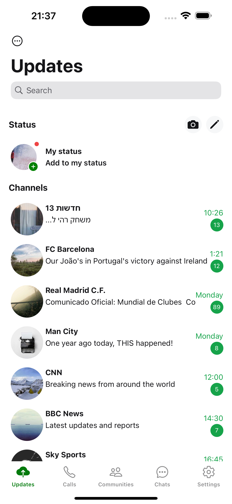

# React Native WhatsApp Clone with Supabase

- [Expo Router](https://docs.expo.dev/routing/introduction/) file-based navigation
- [SMS OTP](https://github.com/supabase) Auth, database and storage With Supabase
- [Reanimated](https://docs.swmansion.com/react-native-reanimated/) 3 for animations
- [Gesture Handler](https://docs.swmansion.com/react-native-gesture-handler/) for gestures
- [Styling](https://github.com/jaredh159/tailwind-react-native-classnames) with NativeWind Css and twrnc

## Screenshots

<div style="display: flex; flex-direction: row;">
  
  
  
  
  
  
  
</div>


## Installation

First, ensure you have Node.js and npm installed on your machine. Then, follow these steps:

1. Clone the repository:
   ```sh
   git clone https://github.com/Motta239/whatsapp.git
   cd whatsapp
2. Install the dependencies:
    ```sh
    npm install
 3. Create an .env file in the root directory of the project and add your Supabase keys with Expo prefix:
      ```sh
    EXPO_SUPABASE_URL=your-supabase-url
    EXPO_SUPABASE_ANON_KEY=your-supabase-anon-key
    EXPO_SUPABASE_SERVICE_ROLE_KEY=your-supabase-service-role-key
4.To run the app on an iOS simulator:
```sh
    npx expo run:ios
